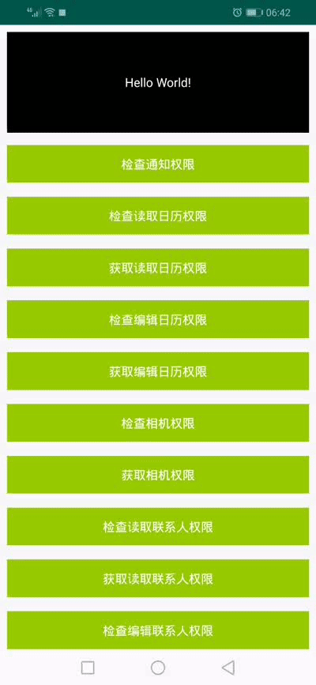

Android权限集成处理工具-PermissionHandler
===
## demo演示：

<br>
PermissionHandler提供给所有除了在"AndroidManifest.xml"声明还需额外处理的权限一些解决方案。目前提供：
<br>
1.android6.0危险权限解决方案。
## 注意点：
*目前为kotln+androidX项目，源码不多，可下载源码自行兼容java或android support等。
## 使用步骤：
#### 1.build.gradle中添加依赖
1.
``` gradle
	allprojects {
		repositories {
			...
			maven { url 'https://jitpack.io' }
		}
	}
```
2.
``` gradle
	dependencies {
	        implementation 'com.github.SOMING2017:PermissionHandler:1.0.4'
	}
```
#### 2.Activity继承
使用到的activity需继承PermissionHandlerActivity;
<br>
kotlin sample:
<br>
``` kotlin
    class MainActivity : PermissionHandlerActivity() {
        ...
    }
```
#### 3.使用permissionHandler(已在PermissionHandlerActivity实例，继承后可调用)
先在"AndroidManifest.xml"声明权限，然后调用permissionHandler对应方法即可。
<br>
kotlin sample:
<br>
1.
``` kotlin
    permissionHandler.checkReadCalendar(baseContext)
```
2.
``` kotlin
   permissionHandler.requestReadCalendar(this,object :OnPermissionSingleListener{
                   override fun success() {
                      printContent("获取读取日历权限:success")
                 }

                   override fun fail() {
                       printContent("获取读取日历权限:fail")
                   }

               })
```
